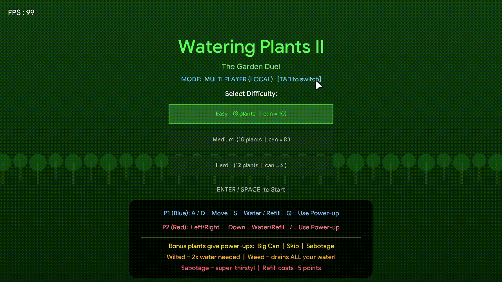
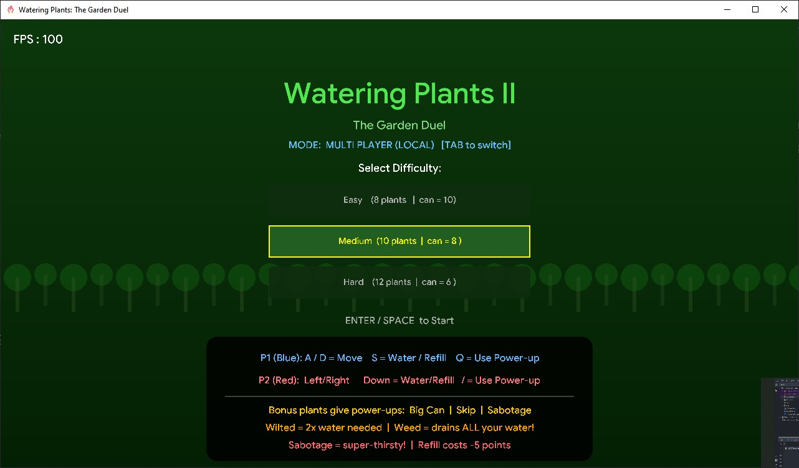
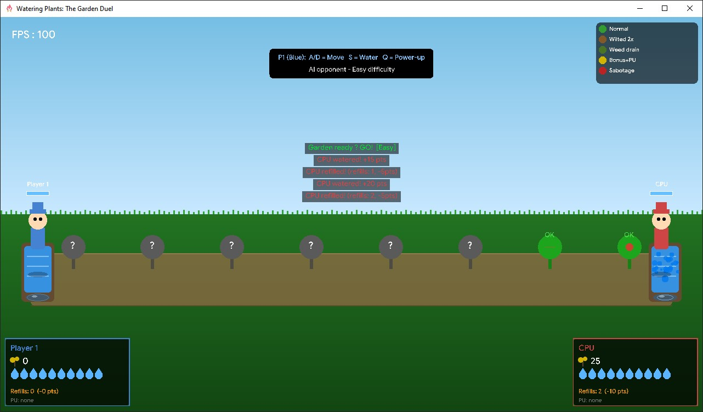
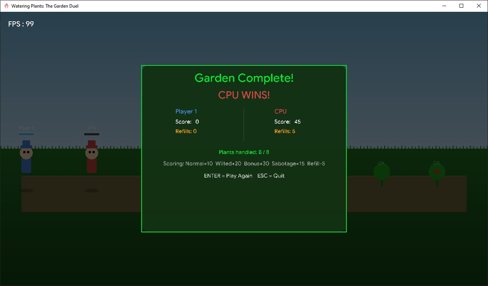

<div align="center">


# Watering Plants II — The Garden Duel

[](https://github.com/Spike271/The_Garden_Duel/actions/workflows/build%20for%20all%20platforms.yml) [](https://github.com/Spike271/The_Garden_Duel/actions/workflows/deploy.yml)

</div>

## About the Project

Two gardeners sprint from opposite ends of a garden, racing to water every plant before the other. Points are scored for plants watered; points are lost for every trip back to the river. Hidden requirements, hazardous
weeds, wilted drought-victims, and sabotage power-ups keep every game chaotic. Play head-to-head on the same keyboard or duel a built-in AI opponent across three difficulty levels.

## Screenshot









## Features

- **Multi Player (Local)**: Two humans share one keyboard, Player 1 vs. Player 2.
  - Player 1 (Blue) uses `A`/`D` to move and `S` to water/refill.
  - Player 2 (Red) uses `←`/`→` to move and `↓` to water/refill.
- **Single Player**: Player 1 vs. a built-in CPU opponent.
  - The AI plans which plant to head for next, decides when it needs to refill first, and reacts to your Sabotage power-ups.
  - Its thinking speed and movement speed scale with the selected difficulty (harder = faster, more decisive CPU).
- **Three Difficulty Levels**: Easy, Medium, and Hard — each changes the number of plants, can size, and max plant cost.
- **Power-ups**: Earned from Bonus plants — Big Can, Skip, and Sabotage.
- **Fullscreen Support**: Toggle fullscreen with `F11`.

## Technologies Used

- **Language**: C++23
- **Graphics Library**: [raylib](https://www.raylib.com/) 6.0

## How to Play

1. Launch the game either the binary or web-version.
2. Use the menu to select the desired mode:
   - **Tab** to switch between Single Player and Multi Player.
   - **Enter/Space** to start a match.
3. Gameplay:
   - Move to a plant and press the action key to water it.
   - If you don't have enough water, walk back to your river and press the action key to refill.
   - Collect power-ups from Bonus plants and activate them with `Q` (Player 1) or `/` (Player 2).
4. The player with the highest score when all plants are watered (or the timer runs out) **wins**.
5. Press **Enter/Space** to replay after the game is over, or **Esc** to quit(only in native binary).

> There is a bug in the web-version when you go fullscreen the canvas somethimes go offset, just reload the webpage if this happens.

## Controls

| Action          | Player 1 (Blue) | Player 2 (Red) / CPU |
| --------------- | --------------- | -------------------- |
| Move left/right | **A** / **D**   | **← →**              |
| Water / Refill  | **S**           | **↓**                |
| Use power-up    | **Q**           | **/**                |

_Pressing the action key at your own river refills your can._
_Pressing it at a plant waters that plant._

Other keys: **F11** toggles fullscreen, **Tab** switches game mode on the menu screen, **Enter/Space** starts a match or replays after game over, **Esc** quits from the game-over screen.

## Game Mechanics

### The Garden (LeetCode 2105 Core)

- Plants are arranged in a single row.
- **P1 starts at the left river, P2 (or the CPU) starts at the right river** — they advance toward each other.
- Each plant's water cost is **hidden until you step on it** (revealed on approach).
- If you don't have enough water, you must walk back and refill. Every refill deducts **5 points** from your score.
- A hard **90-second time limit** guarantees a match always ends, even if the garden isn't fully cleared — the player with the higher score when time runs out wins.

### Scoring

| Event              | Points |
| ------------------ | ------ |
| Water a Normal     | +10    |
| Water a Wilted     | +20    |
| Water a Bonus      | +30    |
| Water a Sabotage   | +15    |
| Hit a Weed         | −5     |
| Each Refill        | −5     |
| Skip power-up used | +5     |

### Plant Types

| Icon | Type         | Effect                                                                |
| ---- | ------------ | --------------------------------------------------------------------- |
| 🌿   | **Normal**   | Standard cost, no surprises.                                          |
| 🍂   | **Wilted**   | Needs more water (higher cost floor).                                 |
| ☠️   | **Weed**     | Stepping on it and watering **drains your entire can** and scores −5. |
| ⭐   | **Bonus**    | Low cost, but grants a random power-up on water.                      |
| 🔴   | **Sabotage** | Super-thirsty — deployed by enemy Sabotage PU.                        |

### Power-ups (earned from Bonus plants)

| Name         | Activation              | Effect                                                                                                            |
| ------------ | ----------------------- | ----------------------------------------------------------------------------------------------------------------- |
| **Big Can**  | Automatic at refill     | Next refill gives **2× your max capacity**.                                                                       |
| **Skip**     | **Q** or **/** at plant | Instantly completes the current plant (+5 pts).                                                                   |
| **Sabotage** | **Q** or **/**          | Converts the enemy's nearest approaching plant into a Sabotage plant with inflated cost — and **hides it again**. |

### Difficulty

| Level  | Plants | Can size | Max plant cost |
| ------ | ------ | -------- | -------------- |
| Easy   | 8      | 10       | 10             |
| Medium | 10     | 8        | 8              |
| Hard   | 12     | 6        | 6              |

On Hard, Wilted, and Sabotage plants can nearly fill your entire can, making every refill decision critical. In Single Player mode, difficulty also controls how quickly the CPU thinks and moves.

## Strategy Tips

- Both players move simultaneously — **race for Bonus plants** before your opponent grabs the power-up.
- A Weed is only triggered when you press the action key on it — you can stand on it safely. Watch out if your opponent is nearby, and they might waste your water by tricking you into pressing the key.
- Save the **Skip** power-up for a Weed or an expensive Wilted plant you can't afford to water.
- The **Sabotage** power-up targets your opponent's _next_ plant — time it when they've just refilled, and you know they'll walk into it.
- Crossing the entire garden to steal plants from the enemy side can be worth it if you have a Big Can be activated.

## Prerequisites

Before building or running this project, ensure you have the following dependencies installed:

- C++23 compatible compiler
- [CMake](https://cmake.org/documentation/) (3.30 or higher)
- [Ninja](https://ninja-build.org/) (recommended)

> Raylib 6.0 is auto-downloaded if not already installed. If you already have raylib 6.0 installed via your package
> manager, the `find_package` step will use it and skip the download entirely.

## Building the Project

### Clone the Repository

```bash
git clone https://github.com/Spike271/The_Garden_Duel.git
```

Navigate to the folder:

```bash
# default name
cd "The_Garden_Duel"
```

### For Windows (Visual Studio)

1. Generate build files:
   ```bash
   cmake -B build
   ```
2. Build the project:
   ```bash
   cmake --build build -j8 --config Release
   ```
3. Run:
   ```bash
   build/The_Garden_Duel.exe
   ```

### For Other Platforms (Also works for Windows)

1. Create and navigate to the build directory:

   ```bash
   mkdir build
   cd build
   ```

2. Generate the build system files using Ninja:

   ```bash
   cmake -G "Ninja" -D CMAKE_CPP_COMPILER=g++ -D CMAKE_BUILD_TYPE=Release ..
   ```

3. Build the project:

   ```bash
   ninja
   ```

4. Run:
   ```bash
   ./build/The_Garden_Duel        # Linux / macOS
   build/The_Garden_Duel.exe      # Windows
   ```

### Building for Web

1. Ensure you have [Emscripten](https://emscripten.org/docs/getting_started/downloads.html) installed and activated in your environment.

2. Create and navigate to the build-web directory:

   ```bash
   mkdir build-web
   cd build-web
   ```

3. Generate the build files using Emscripten:

   ```bash
   emcmake cmake .. -DPLATFORM=Web -DCMAKE_BUILD_TYPE=Release
   ```

4. Build the project:

   ```bash
   emmake make
   ```

5. The build will generate the following files:
   - `The_Garden_Duel.html` - The HTML page to load the game
   - `The_Garden_Duel.js` - JavaScript code
   - `The_Garden_Duel.wasm` - WebAssembly binary
   - `The_Garden_Duel.data` - Game resources

6. To run the game, you'll need to serve these files using a local web server:

   ```bash
   # Using Python 3
   python3 -m http.server 8080
   # Then open localhost:8080/PING_PONG.html in your browser

   # Alternatively, if you have the emscripten binaries in your path, you can run the following command
   emrun PING_PONG.html
   ```

> The `res/` folder (font, icon, window resource) is automatically copied next to the built executable after every
> build — the game looks there (relative to the executable) for `res/GoogleSans.ttf` and `res/logo.png`, falling back
> to raylib's default font if the custom one can't be found.

## Acknowledgements

- [raylib](https://www.raylib.com/) — A simple and easy-to-use library for game development
